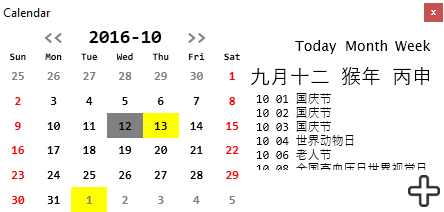

# 程序设计项目 大一暑假作业
## 题目概要
windows 桌面日历(不限windows,可以其他操作系统)
难度等级:高
要求:
1.能按周,月的方式显示日历
2.能显示农历和节假日
3.最好能作为记事本使用,记录每一天的日常行为
## 前期准备
开发环境:Visual Studio 2015
编程语言:XAML,C#
上网找一大堆日历看看
感谢[iWay7](https://github.com/iWay7/Calendar),我在他的基础上完成
感谢GOOGLE
## 效果

